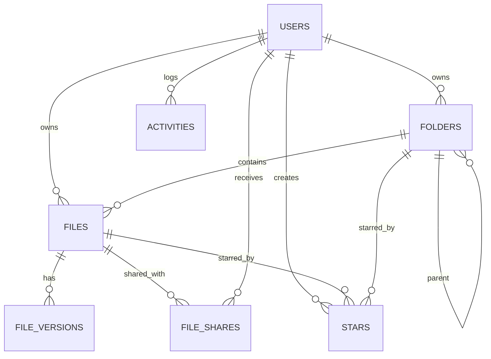

# Labmentix Drive

## Project Overview
- Full-stack cloud drive: React + Vite frontend (Tailwind, Framer Motion) with an Express API backed by Supabase (Postgres + Storage).
- Core flows: auth (email/password + OAuth sync), folder hierarchy, file uploads with versioning, sharing (direct invites + public links), starring, activity log, search, trash, storage quota, image thumbnails via signed URLs.
- Security: JWT-protected API, per-file access checks, hashed passwords, optional password + expiry on public links, and CORS restricted to configured frontends.
- Storage: Supabase Storage bucket `drive` for file blobs; database tables track metadata, versions, shares, stars, and activities.

## ER Diagram


Table notes:
- `users`: identity, password hash, profile fields.
- `folders`: `owner_id`, `parent_id` (self-referential tree).
- `files`: `owner_id`, `folder_id`, `storage_key`, `mime_type`, `version`, `is_deleted`, optional `public_token`, `link_password`, `link_expires_at`.
- `file_versions`: historical blobs per file.
- `file_shares`: per-user permission (`viewer` / `editor`) for a file.
- `stars`: user-starred files or folders.
- `activities`: audit log for user actions.

## Validations, Permissions, and Protections
- JWT required on all authenticated routes (middleware in backend route files).
- Auth: emails are unique, passwords hashed with bcrypt, JWTs signed with `JWT_SECRET`; OAuth sync creates users on first login ([backend/routes/auth.js](backend/routes/auth.js)).
- CORS allowlist for frontend origins with credential support ([backend/server.js](backend/server.js)).
- File access: `getAccessLevel` enforces owner/editor/viewer roles for reads, updates, deletes, and version restores ([backend/utils/permissions.js](backend/utils/permissions.js)).
- Sharing: per-user invites via `file_shares`; public links can set password + expiry and are revocable ([backend/routes/share.js](backend/routes/share.js)).
- Uploads: versioning stored in `file_versions`; soft deletes go to trash; permanent delete also removes storage objects; storage usage endpoint enforces a 1 GB ceiling ([backend/routes/files.js](backend/routes/files.js)).
- Logging: user actions recorded for activity feed ([backend/utils/logger.js](backend/utils/logger.js) and [backend/routes/activities.js](backend/routes/activities.js)).

## Live Deployment
- **Backend (Render):** https://labmentix1.onrender.com/
- **Frontend (Vercel):** https://labmentix1-qox9.vercel.app/

## Run Locally
### Prerequisites
- Node.js 18+
- Supabase project with a Storage bucket named `drive` and the tables above (enable RLS as needed).

### Backend (Express API)
1) Create `backend/.env`:
```
PORT=5000
FRONTEND_URL=http://localhost:5173
SUPABASE_URL=your-supabase-url
SUPABASE_KEY=your-supabase-service-role-key
JWT_SECRET=change-me
```
2) Install and start:
```
cd backend
npm install
npm run dev   # or npm start
```

### Frontend (Vite + React)
1) Create `client/.env`:
```
VITE_API_URL=http://localhost:5000/api
VITE_SUPABASE_URL=your-supabase-url
VITE_SUPABASE_KEY=your-supabase-anon-key
```
2) Install and run:
```
cd client
npm install
npm run dev
```
3) Open the shown URL (default http://localhost:5173).

### Notes
- Ensure the Supabase Storage bucket name matches the code (`drive`) for uploads, downloads, and thumbnails.
- Public link downloads rely on signed URLs; adjust expiry durations in share routes if needed.
- For production, set `FRONTEND_URL` to your deployed client origin and rotate `JWT_SECRET`.
